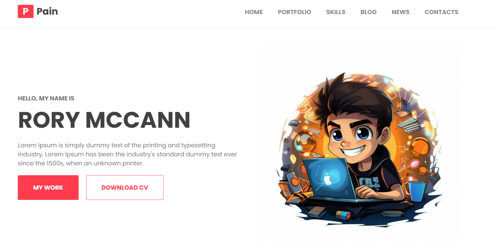

<h2 align="center">
  Welcome to My Portfolio Website! <br/>
  <a href="https://github.com/TihomirDenev/Portfolio" target="_blank">PortFolio</a>
</h2>
<div align="center">
  
</div>

#  Description

- The site is designed with a modern, responsive layout featuring a header, main content sections, and a footer.
- CSS styles are applied to ensure a cohesive design, with adjustments for different screen sizes using media queries.
  <br/><br/>

#  Technologies Used

- Languages:   

- Browsers:     
  <br/><br/>

#  Features

- **_Header:_** Contains the navigation menu for quick access to various sections of the site, such as About Me, Portfolio, Skills, and Blog.
- **_Feedback Section:_** Showcases testimonials or feedback from clients, displayed in a responsive grid layout. Each feedback card includes an image, client name, and a brief testimonial.
- **_News Section:_**
  - Displays recent updates or news in a two-column layout for larger screens and a single-column layout for smaller screens.
  - Each news item features an image and a brief description, with a focus on visual appeal and clarity.
- **_Contact Section:_**
  - Provides contact information and a form for users to get in touch.
  - Includes fields for name, email, meeting date, type of business, and a message. The form is validated in real-time, ensuring that all required fields are correctly filled before submission.
- **_Footer:_**
  - Contains additional information and links, including:
    1. Footer Intro: A brief description and logo.
    2. Quick Links: Navigation links to different sections of the site, with dropdown functionality for smaller screens.
    3. Contact Info: Details including address, phone number, and email, with dropdown functionality for smaller screens.
    4. Support Links: Links to privacy policy, testimonials, and contact manager.
  - The footer adapts to screen size changes, switching between a multi-column layout on larger screens and a stacked layout with dropdowns on smaller screens.

# 🗜 JavaScript Functionality:

- **_Form Validation:_** Ensures that all required fields in the contact form are correctly filled out before submission. Real-time validation provides immediate feedback to the user.
- **_Dropdown Toggle:_** Manages the visibility of footer sections (Quick Links, Contact Info, Support Links) with a toggle mechanism for smaller screens.
- **_Smooth Scrolling:_** Enhances user experience by enabling smooth scrolling to different sections of the page when navigation links are clicked.

# 🛠 Getting Started

1. Clone the [Portfolio GitHub repository](https://github.com/TihomirDenev/Portfolio.git) locally:

```bash
git clone https://github.com/TihomirDenev/Portfolio.git
```

2. Navigate to the project directory:

```bash
cd My-PortFolio
```

3. Install project dependencies:

```bash
npm install
```

4. To run the project, use the following command:

```bash
npm start
```

5. Open localhost link in browser to view web-platform.

# ⚖ License

- This project is licensed under the [MIT License](https://opensource.org/licenses/MIT).
