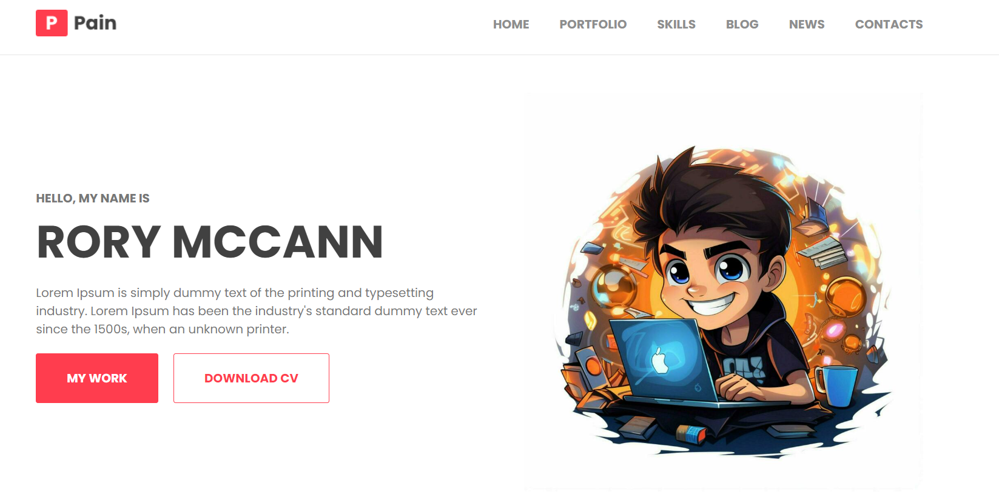

# 🎨 Personal Portfolio Website

<div align="center">
  
  <br/>
  <a href="https://portfolio-example-beige-six.vercel.app/" target="_blank">View on Web</a>
</div>

## 📋 Overview

A modern, responsive personal portfolio website showcasing professional work, skills, and contact information. Built with vanilla HTML, CSS, and JavaScript for optimal performance and maintainability.

## ✨ Features

**🎯 Core Sections**

- **Header Navigation**: Smooth scrolling navigation with mobile-responsive burger menu
- **Introduction**: Hero section with personal introduction and call-to-action buttons
- **Portfolio**: Grid layout showcasing professional work and projects
- **Skills**: Visual skill bars with percentage indicators
- **Feedback**: Client testimonials in responsive card layout
- **News/Updates**: Latest news and updates section
- **Contact**: Interactive contact form with real-time validation
- **Footer**: Comprehensive footer with quick links and contact information

**🔧 Interactive Features**

- **Form Validation**: Real-time validation for contact form fields
- **Responsive Design**: Mobile-first approach with breakpoints for all devices
- **Smooth Scrolling**: Enhanced navigation experience
- **Dropdown Menus**: Collapsible footer sections for mobile devices
- **Dynamic Button States**: Form submission button updates based on validation

## 🛠️ Technologies Used

### Frontend

  

### Browser Support

   

## 🚀 Getting Started

1. Clone the repository:
   ```bash
   git clone https://github.com/TihomirDenev/Portfolio.git
   ```
2. Navigate to the project directory:
   ```bash
   cd Portfolio
   ```
3. Install dependencies (for live reload during development):
   ```bash
   npm install
   ```
4. Start the development server:
   ```bash
   npm start
   ```
5. Open `http://localhost:3000` in your browser

## 📁 Project Structure

```
Portfolio/
├── assets/
│   ├── files/
│   │   └── CV.pdf
│   └── images/
│       ├── home-page.png
│       ├── rory-photo.jpg
│       └── [other images]
├── styles/
│   ├── variables.css
│   ├── header.css
│   ├── introduction.css
│   ├── portfolio.css
│   ├── skills.css
│   ├── feedback.css
│   ├── latest-update.css
│   ├── contacts.css
│   └── footer.css
├── index.html
├── style.css
├── script.js
├── package.json
└── README.md
```

## 🎨 Design Features

- **Responsive Layout**: Adapts seamlessly to desktop, tablet, and mobile devices
- **Modern UI**: Clean, professional design with attention to typography and spacing
- **CSS Variables**: Consistent theming with CSS custom properties
- **Modular CSS**: Organized stylesheets for maintainable code
- **Smooth Animations**: Subtle transitions and hover effects

## 🔍 JavaScript Functionality

### Form Validation

- Real-time field validation with error messages
- Email format validation
- Date validation (future dates only)
- Minimum character requirements for messages
- Dynamic button state management

### Navigation

- Smooth scrolling to page sections
- Mobile-responsive burger menu
- Active state management

### Interactive Elements

- Footer dropdown toggles for mobile
- Form submission handling
- Dynamic content updates

## 📱 Responsive Breakpoints

- **Desktop**: 1024px and above
- **Tablet**: 768px - 1023px
- **Mobile**: Below 768px

## 📄 License

This project is licensed under the MIT License - see the [LICENSE](LICENSE) file for details.

---

⭐ If you found this project helpful, please give it a star on GitHub!
